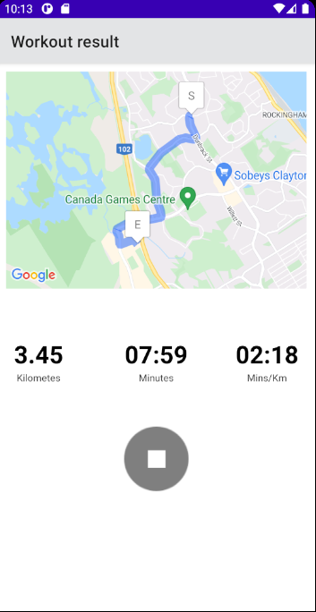
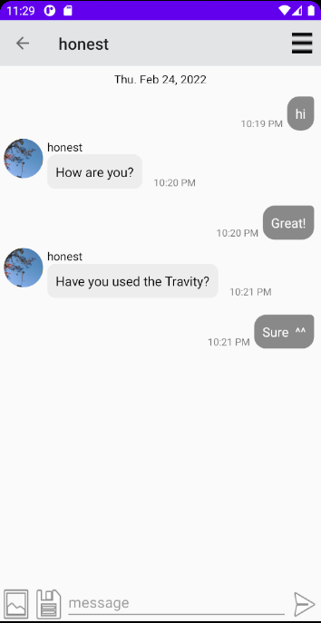

# Travity

### Summary
This is a personal project.
Let's create an application to write exercise acvitities.

### Background
Consistent exercise causes the body to produce endorphins, decrease anxiety and create feelings of happiness. 
I enjoyed running for my health and for making new own records. I used to practice along riverside and participated in 10K-marathon events. 
I ran on the same course to prepare for an event as usual. 
Sometimes, I wrote it on notebook. However, I could not remember all records after running.
I want to keep recording and compare to the previous.

### Goals
This application gives:
+ Recording time, distance, and pace.
+ Showing the history of activity
+ Managing groups that joins
+ Chatting with friends.

### Source
Share source related to UI of this application.
 
### Screen Shots

